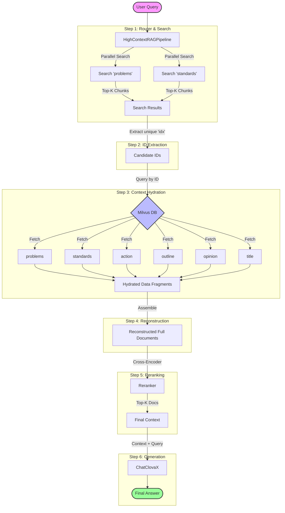

# High-Context RAG Architecture

This document illustrates the "Split & Merge" architecture used in the High-Context RAG system.

## Key Components
1.  **Split Search**: We only search `problems` and `standards` collections first because they contain the most distinctive keywords ("Hooks").
2.  **ID-Based Hydration**: Once we find a relevant chunk, we use its `idx` to pull *all* related information from other collections, ensuring the LLM sees the full picture.
3.  **Reconstruction**: Fragments are reassembled into a structured format (Title, Outline, Problems, Standards, Action, Opinion) before being passed to the LLM.
