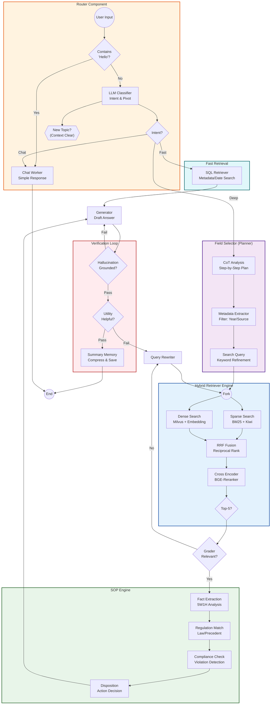

# Modular Agentic RAG Architecture (CRAG + Self-RAG + SOP)

This document describes the high-level architecture of the Modular Agentic RAG system for the AURA Audit Assistant. It combines **Corrective RAG (CRAG)**, **Self-RAG**, and **Standard Operating Procedure (SOP)** integration to ensure high precision, regulatory compliance, and hallucination-free generation.

## Agentic Flow (White-Box Logic View)

## Core Components

## Data Flow
1. **Query** -> `Field Selector` -> Structured Metadata.
2. **Metadata + Query** -> `Hybrid Retriever` -> Raw Docs.
3. **Raw Docs** -> `Retrieval Grader` -> Filtered Relevant Docs.
4. **Relevant Docs** -> `SOP Retriever` -> SOP/Rules.
5. **Docs + SOP** -> `Generator` -> Draft Answer.
6. **Draft Answer** -> `Verification Loop` -> Final Answer.

## Context Persistence Strategy (Memory Pivot)
To handle multi-turn conversations effectively, the Router employs a **Pivot Detection** mechanism:
- **New Topic (Pivot)**: If the user asks about a new entity (e.g., "Switching from Incheon to Gas Corp"), the Router sets `is_new_topic=True`. This **clears** the `persist_documents` to ensure a fresh search without context pollution.
- **Follow-up**: If the user asks for more details (e.g., "Give me the file for #1"), the Router sets `is_new_topic=False`. The previous `documents` are maintained in `persist_documents` so the SQL Retriever can resolve references like "Item #1".
