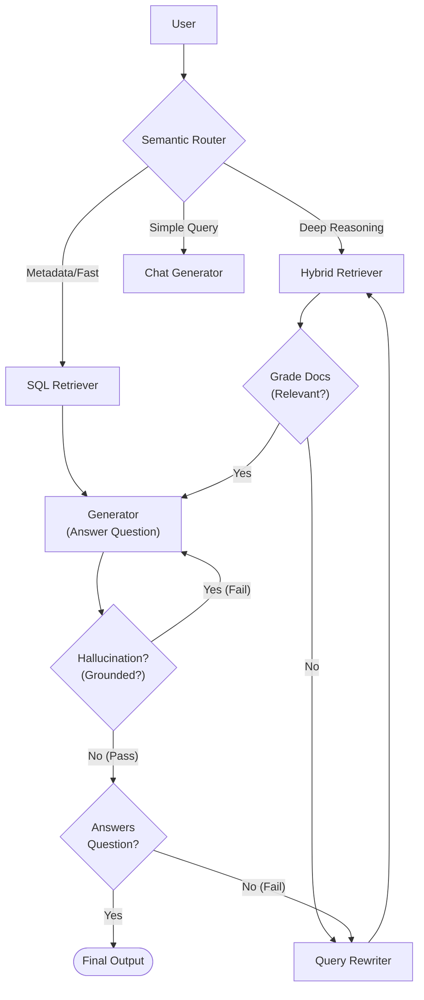

# 🦅 AURA (Audit-Understanding and Report Automation)

> **Agentic RAG 기반 공공 감사 자동화 어시스턴트**
>
> *아이펠 리서치 14기 AURA 팀*

AURA는 공공기관 감사 보고서를 분석하여, 감관들이 더 빠르고 정확하게 **규정 위반 여부를 판단**하고 **유사 사례를 검색**할 수 있도록 돕는 AI 에이전트 시스템입니다.

---

## 🏗️ Architecture Overview

단순한 RAG를 넘어, **Agentic Workflow**와 **Hybrid Retrieval** 전략을 결합하여 복잡한 감사 질의를 해결합니다.



### Key Features
- **🧠 Agentic RAG (LangGraph)**: 슈퍼바이저(Supervisor)가 질문의 의도를 파악하고, 최적의 작업자(Worker)에게 업무를 위임합니다.
- **🕸️ Hybrid Retrieval**: 
  - **Milvus**: 비정형 텍스트(판례, 감사 보고서 본문) 검색
  - **SQLite**: 정형 메타데이터(날짜, 기관명, 카테고리) 정밀 검색 (**New!**)
- **📜 SOP (Standard Audit Procedure)**: 실제 감사관의 사고 과정(사실추출 -> 규정매칭 -> 위반판단 -> 처분결정)을 모방한 논리적 추론 파이프라인.
- **⚡ Adaptive Retrieval**: 검색 결과가 빈약할 경우, 에이전트가 스스로 쿼리를 재작성(Reformulation)하거나 필드를 확장하여 재검색합니다.

---

## 🛠️ Tech Stack

| Component | Technology |
|---|---|
| **LLM** | HyperCLOVA X (HCX-003, Dash), OpenAI GPT-4o, Gemini |
| **Orchestration** | LangChain, LangGraph |
| **Backend** | FastAPI, Python 3.10+ |
| **Frontend** | Next.js 14, React, TailwindCSS |
| **Database** | Milvus (Vector), SQLite (Meta), Redis (Memory) |
| **Preprocessing** | Docling (PDF Parsing) |

---

## 🧠 Model Strategy (Hybrid LLM Architecture)

최적의 성능과 안정성을 위해 **HyperCLOVA X**와 **GPT-4o-mini**를 적재적소에 배치하는 **하이브리드 전략**을 사용합니다.

| Role | Model (Type) | Why? (Strategic Decision) |
|---|---|---|
| **Router (지휘관)** | **HCX-003 (Heavy)** | 사용자 의도의 미세한 뉘앙스를 파악하고 정확한 경로로 안내하기 위해 고성능 한국어 모델 사용. |
| **Field Selector (분석가)** | **GPT-4o-mini (Light)** | 복잡한 **JSON 스키마**를 엄격하게 준수해야 하므로, 구조적 출력 안정성이 검증된 GPT 모델 사용. |
| **SOP Engine (감사관)** | **HCX-003 (Heavy)** | 법령 해석과 논리적 위반 여부 판단(Reasoning)에는 높은 추론 능력이 요구됨. |
| **SQL Retriever (데이터)** | **HCX-DASH (Light)** | 정형 데이터 조회 및 간단한 변환 업무는 속도가 빠른 경량 모델로 처리하여 응답 속도 최적화. |
| **Generator (작가)** | **HCX-DASH (Light)** | 검색된 문맥을 바탕으로 답변을 작성하는 업무는 경량 모델로도 충분하며, 토큰 비용 절감 효과. |
| **Verifier (검수관)** | **GPT-4o-mini (Light)** | O/X 형태의 이진 판단 및 구조화된 평가 결과를 빠르고 저렴하게 수행. |

> **Key Insight**: 한국어 자연어 처리와 추론이 필요한 영역은 **HyperCLOVA X**가, 엄격한 포맷 준수가 필요한 구조적 영역은 **GPT**가 담당하여 상호 보완적인 시너지를 냅니다.

---

## 🚀 Getting Started

### 1. Prerequisites
- Python 3.10+
- Node.js 18+
- Docker (for Milvus/SQLite/Redis)

### 2. Installation
```bash
git clone https://github.com/Aiffelthon-AURA/AURA.git
cd AURA

# Install Python Dependencies
pip install -r requirements.txt

# Install Frontend Dependencies
cd 04_web_app/frontend
npm install
cd ../..
```

### 3. Running the App
백엔드와 프론트엔드를 한 번에 실행합니다.
```bash
./start_chatbot.sh
```
- **Frontend**: http://localhost:3000
- **Backend API**: http://localhost:8000/docs

---

## 📂 Directory Structure

```
AURA/
├── 00_data/              # Raw data & Processed PDFs
├── 03_agentic_rag/       # Core Agent Logic (LangGraph)
│   ├── modules/          # Agent Tools (Retriever, Generator, SOP)
│   ├── graph.py          # Main Workflow Graph Definition
│   └── state.py          # Agent State Schema
├── 04_web_app/           # Web Application
│   ├── backend/          # FastAPI Server
│   └── frontend/         # Next.js Client
├── experiments/          # Experimental Notebooks & Scripts (Refactored)
└── start_chatbot.sh      # Unified Startup Script
```


---

## 📝 License
This project is part of the AIFFEL Research Course.
