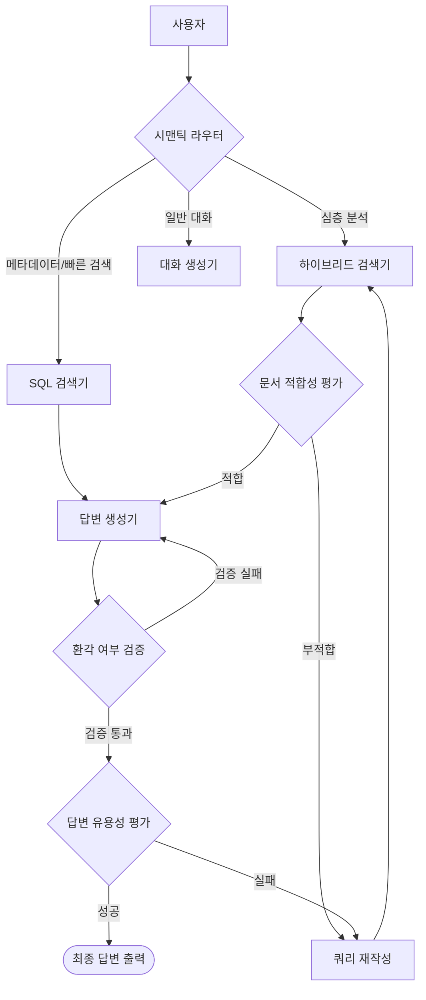

# AURA (감사 분석 및 보고서 자동화 시스템)

> **Agentic RAG 기반 공공 감사 자동화 어시스턴트**
> *모두의연구소 아이펠 리서치 14기 AURA 팀*

AURA는 공공기관 감사 보고서를 심층 분석하여, 감사관이 **규정 위반 여부를 신속하게 판단**하고 **유사 사례를 정밀하게 검색**할 수 있도록 지원하는 AI 에이전트 시스템입니다.

---

## 아키텍처 개요 (Architecture Overview)

단순한 RAG 구조를 넘어, **에이전트 워크플로우(Agentic Workflow)**와 **하이브리드 검색(Hybrid Retrieval)** 전략을 결합하여 복잡한 감사 질의를 해결합니다.



### 주요 특징 (Key Features)

* **에이전트 기반 RAG (LangGraph)**: 관리자(Supervisor)가 질문의 의도를 분석하여 최적의 작업 에이전트에게 업무를 할당합니다.
* **감사 분석관 (HCX-007)**: 규정 위반 여부를 심층 진단하고, 필요한 경우 공식 감사 보고서 작성을 제안합니다.
* **보고서 에이전트 (HCX-003)**: 분석된 사실 관계를 바탕으로 표준 양식의 초안을 작성하며, 자가 교정(Self-Correction) 과정을 통해 환각을 제거합니다.
* **하이브리드 검색 전략**:
* **Milvus**: 비정형 텍스트(판례, 감사 보고서 본문) 벡터 검색
* **SQLite**: 정형 데이터(날짜, 기관명, 카테고리) 정밀 필터링


* **감사 표준 절차(SOP) 통합**: 실제 감사관의 사고 과정(사실 추출 → 규정 매칭 → 위반 판단 → 처분 결정)을 추론 파이프라인에 이식했습니다.
* **적응형 검색(Adaptive Retrieval)**: 검색 결과가 불충분할 경우 에이전트가 스스로 검색어를 재구성하거나 범위를 확장하여 재검색을 수행합니다.

---

## 기술 스택 (Tech Stack)

| 구분 | 기술 도구 |
| --- | --- |
| **LLM** | HyperCLOVA X (Dash, HCX-003, HCX-007) |
| **Orchestration** | LangChain, LangGraph |
| **Backend** | FastAPI, Python 3.10+ |
| **Frontend** | Next.js 14, React, TailwindCSS |
| **Database** | Milvus (Vector), SQLite (Meta), Redis (Memory) |


---

## 모델 운용 전략 (Hybrid LLM Architecture)

성능 효율성과 비용 최적화를 위해 **하이브리드 모델 전략**을 채택하였습니다. 작업 성격에 따라 **추론 전용 모델**과 **범용 모델**을 분리하여 배치했습니다.

| 역할 | 채택 모델 | 선정 사유 (Strategic Decision) |
| --- | --- | --- |
| **감사 분석관 (Analyst)** | **HCX-007 (Reasoning)** | 사실 관계의 모순을 탐지하고 규정 위반을 판단하는 고도의 **추론 능력**이 필수적입니다. |
| **보고서 작성기 (Writer)** | **HCX-003 (Standard)** | 정해진 양식에 따른 문서 작성 및 **지시 이행** 능력이 우수하며, 자가 교정 로직으로 정확도를 보완합니다. |
| **지휘관 (Router)** | **HCX-003 (Standard)** | 사용자 의도를 파악하여 신속하게 분기 처리를 수행하는 밸런스 모델이 적합합니다. |
| **필드 추출기 (Field Selector)** | **HCX-003 (Standard)** | 복잡한 **JSON 스키마**를 엄격하게 준수하는 구조적 출력 안정성을 고려했습니다. |
| **데이터 검색기 (Retriever)** | **HCX-DASH-002 (Light)** | 단순 데이터 조회 및 SQL 변환 업무를 빠르게 처리하여 시스템 **응답 속도**를 최적화합니다. |

---

## 시작하기 (Getting Started)

### 사전 요구사항

* Python 3.10 이상
* Node.js 18 이상
* Docker (Milvus, SQLite, Redis 실행용)

### 설치 및 실행

```bash
# 1. 저장소 복제
git clone https://github.com/Aiffelthon-AURA/AURA.git
cd AURA

# 2. 파이썬 의존성 설치
pip install -r requirements.txt

# 3. 프론트엔드 의존성 설치
cd web_app/frontend
npm install
cd ../..

# 4. 시스템 실행
./start_chatbot.sh

```

* **프론트엔드 주소**: http://localhost:3000
* **백엔드 API 문서**: http://localhost:8000/docs

---

## 프로젝트 구조 (Directory Structure)

```
AURA/
├── common/               # 공통 유틸리티 및 모델 팩토리
├── rag/                  # RAG 파이프라인 모음
│   ├── advanced_rag/     # 어드밴스드 RAG
│   ├── agentic_rag_v1/   # 에이전트 RAG (요약 데이터, V1)
│   ├── agentic_rag_v2/   # 에이전트 RAG (요약 데이터 + 원본 데이터, V2)
│   │   ├── modules/      # 에이전트 도구 (검색기, 생성기, SOP)
│   │   ├── graph.py      # 메인 워크플로우 그래프 정의
│   │   └── state.py      # 에이전트 상태 스키마 정의
│   └── naive_rag/        # 기본 RAG 베이스라인
├── web_app/              # 웹 어플리케이션
│   ├── backend/          # FastAPI 서버
│   └── frontend/         # Next.js 클라이언트
├── experiments/          # 실험용 노트북 및 테스트 스크립트
└── start_chatbot.sh      # 통합 실행 스크립트

```

---

## Contributors

<div align="center">
  <table>
    <tr>
      <td align="center"><a href="https://github.com/9cheol2"><br /><sub><b>이규철</b></sub></a></td>
      <td align="center"><a href="https://github.com/JSKIM5098"><br /><sub><b>김재성</b></sub></a></td>
      <td align="center"><a href="https://github.com/beomyongchoi"><br /><sub><b>최범용</b></sub></a></td>
    </tr>
  </table>
</div>

