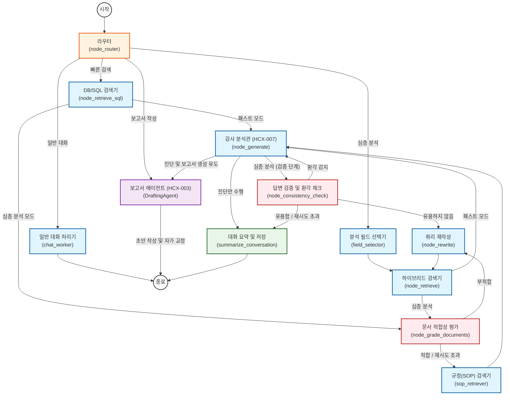

# 모듈형 Agentic RAG 아키텍처 (CRAG + Self-RAG + SOP)

이 문서는 AURA Audit Assistant(감사 챗봇)의 모듈형 Agentic RAG 시스템에 대한 고수준 아키텍처를 설명합니다. 이 시스템은 **Corrective RAG (CRAG)**, **Self-RAG**, 그리고 **SOP (Standard Operating Procedure)** 통합을 결합하여, 높은 정확도와 규정 준수를 보장하고 환각(Hallucination) 없는 답변 생성을 목표로 합니다.

## Agentic Flow (화이트박스 로직 뷰)

## 핵심 컴포넌트 (Core Components)

1. **Router Component**: 사용자 입력의 의도를 분류하고, Fast Track(단순 검색)과 Deep Track(심층 분석)을 결정합니다. 또한, 대화 맥락이 변경되었는지(Unique Pivot) 감지하여 메모리를 관리합니다.
2. **Field Selector**: 복잡한 질문을 분석하여 메타데이터 필터를 추출하고 검색 전략을 수립합니다.
3. **Hybrid Retriever**: 키워드 검색(Sparse)과 의미 기반 검색(Dense)을 결합하여 최적의 문서를 찾아냅니다.
4. **SOP Engine**: 감사 규정(SOP)에 따라 사실 관계를 확인하고 위반 여부를 판단합니다.
5. **Report Agent (New)**: Analyst(HCX-007)의 진단을 바탕으로 공식 보고서 초안을 작성하고, 스스로 교정(Self-Correction)을 수행합니다.
6. **Verification Loop**: 생성된 답변이 문서에 기반하는지(Hallucination Check), 질문에 유용한지(Utility Check) 검증하고 필요 시 재수행합니다.

## 데이터 흐름 (Data Flow)
1. **Query** -> `Field Selector` -> 구조화된 메타데이터(Structured Metadata).
2. **Metadata + Query** -> `Hybrid Retriever` -> 원본 문서(Raw Docs).
3. **Raw Docs** -> `Retrieval Grader` -> 필터링된 관련 문서(Relevant Docs).
4. **Relevant Docs** -> `SOP Retriever` -> SOP/규정 매칭.
5. **Docs + SOP** -> `Audit Analyst` -> 진단 결과(Diagnosis).
6. **Diagnosis** -> `Report Agent` -> 보고서 초안(Draft) -> 자가 교정(Refined Report).
7. **Refined Report** -> `User` -> 최종 확인.

## 컨텍스트 유지 전략 (Memory Pivot)
다중 턴(Multi-turn) 대화를 효과적으로 처리하기 위해 Router는 **Pivot Detection** 메커니즘을 사용합니다:
- **New Topic (Pivot)**: 사용자가 새로운 주제나 대상(예: "인천공항에서 가스공사로 변경")을 물어보면, Router는 `is_new_topic=True`로 설정합니다. 이때 `persist_documents`를 **초기화(Clear)** 하여 이전 맥락이 검색을 방해하지 않도록 합니다.
- **Follow-up**: 사용자가 이전 내용에 대한 추가 질문(예: "1번 항목 파일 줘", "더 자세히 설명해")을 하면, Router는 `is_new_topic=False`로 설정합니다. 이 경우 이전의 `documents`를 `persist_documents`로 유지하여 SQL Retriever가 "1번 항목"과 같은 참조를 해결할 수 있게 합니다.
